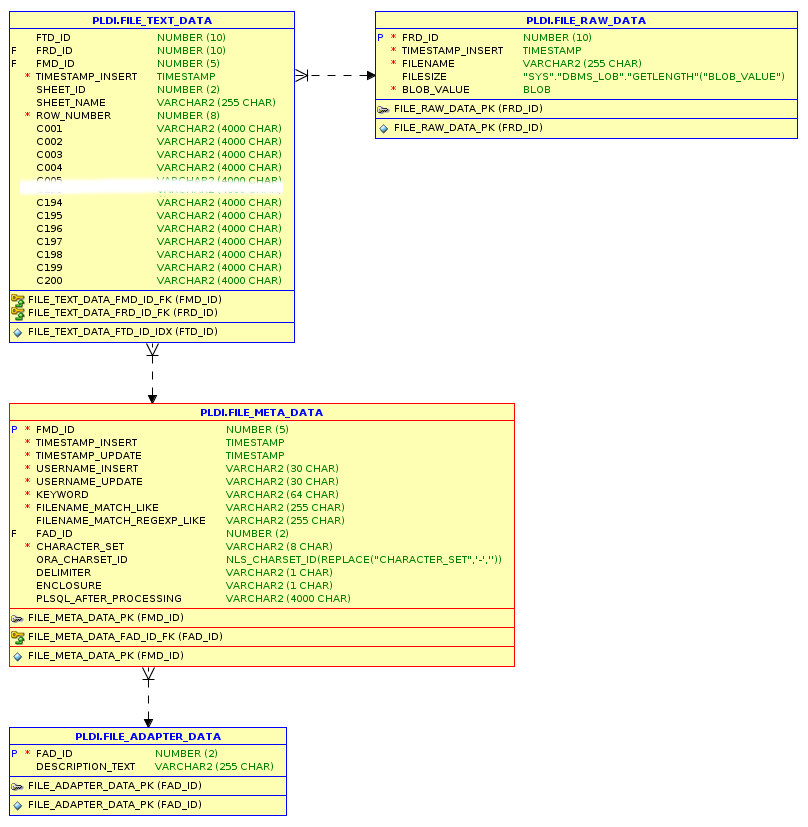

# PLDI

## Introduction

With **PL**/SQL **D**ata **I**ntegration it is possible to read in Oracle every binary file and - with the corresponding adapter - transform the (textual) data into a single table for further usage.

Main features from **PLDI**:

- binary files can be read from a directory object, from a huge string (CLOB) or from another table (for example **apex_collections**)
- adapter for CSV ("Character"-Delimited-Values) comes out of the box
- define a PL/SQL statement to execute after the file processing ("push" info about file processing)

## Installation

Download the `master.zip`archive and install **PLDI** with SQL*Plus or SQL Developer.

If you have already a directory object and user created, connect with the user and run the `install_headless.sql` file (pldi_directory is the only possible parameter).

If you do not have  a directory object and user created, connect as SYSDBA and run the `install.sql` file.

You can pass the following parameters:

1. pldi_directory (Default: **PLDI_FILES**)
2. pldi_path_name (Default: **/opt/ora_files**)
3. pldi_user (Default: **pldi**)
4. pldi_password Default: **pldi**)

Here is an example in Linux doing the whole installation in one command:

```bash
wget https://github.com/teotiger/pldi/archive/master.zip && unzip master.zip && cd pldi-master && sqlplus "sys/supersecretpassword@localhost as sysdba" @install.sql
```

## Tests

PLDI is using [utPLSQL](https://github.com/utPLSQL/utPLSQL) for UnitTests.

Run one of the following commands inside your PLDI schema to get information about the tests:

```sql
-- plsql
exec ut.run();
-- sql
select * from table(ut.run());
```

## Usage / API

After successful installation define your meta data by using the `FILE_META_DATA_API` package. To read for example every TAB delimited file use:
```plsql
exec file_meta_data_api.insert_row(
    i_keyword => 'tsv example',
    i_filename_match_like => '*.tsv',
    i_filename_match_regexp_like => null,
    i_fad_id => 1,
    i_character_set => 'UTF-8',
    i_delimiter => chr(9),
    i_enclosure => null,
    i_plsql_after_processing => null);
```

See `example_usage.sql` for more information.

## Data Model



Every table has it own api package for DML operations.

## Credits

- Alexandria PL/SQL Utility Library https://github.com/mortenbra/alexandria-plsql-utils
- Blogpost from Carsten Czarski https://blogs.oracle.com/apex/easy-xlsx-parser:-just-with-sql-and-plsql
- OraOpenSource http://www.oraopensource.com/

## License

PLDI is released under the [MIT license](https://github.com/teotiger/pldi/blob/master/license.txt).

## ToDo / Roadmap

The next features will be: 
- adapter for XLSX
- more Unit Tests
- optimize CSV parser (with benchmark)
- ....

## Version History

Version 0.9.2 – April 11, 2019

- columns extended from 50 to 200
- bugfix in package FILE_ADAPTER_DATA_IMP_1

Version 0.9.1 – March 26, 2019

Version 0.9 – March 18, 2019